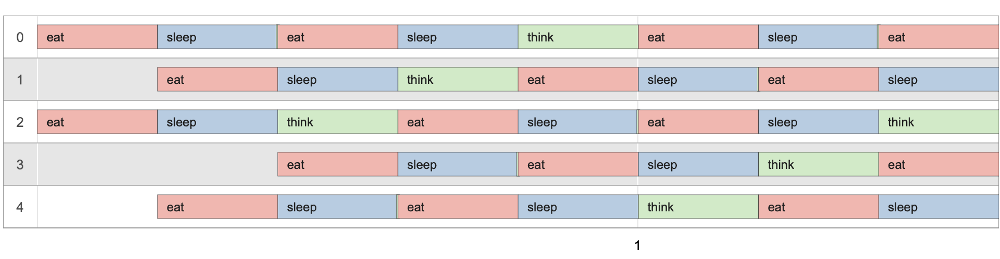
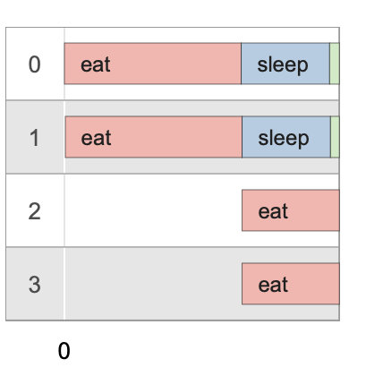

# **Philosophers**

The goal of this project is to learn how to work with posix threads, mutexes, multiprocessing in UNIX systems and semaphores. Let's imagine a surtain number of **philosophers** sitting by the round table. We create separate **thread/process** for each **philosopher**. There is a large bowl of spaghetti in the middle of the table. The philosophers alternatively **eat**, **think**, or **sleep**. While they are eating, they are not thinking nor sleeping; while thinking, they are not eating nor sleeping; and, of course, while sleeping, they are not eating nor thinking. There are also **forks** on the table. There are as many forks as philosophers. Forks are represented by **mutexes/semaphore** Because serving and eating spaghetti with only one fork is very inconvenient, a philosopher takes their right and their left forks to eat, one in each hand. When a philosopher has finished eating, they put their forks back on the table and start sleeping. Once awake, they start thinking again. The simulation stops when a philosopher dies of starvation.
<br><br>

## **Platform**

macOS (x86).
<br><br>

## **Instruments**

**pthread.h** library is used to work with threading, **semaphore.h** and **signal.h** libraries are used for interprocess communication.

Source files are lintered by "**42 Norminette**" linter.

[Visualizer](https://nafuka11.github.io/philosophers-visualizer/) to simplify logs visualization.
<br><br>

## **Usage**

Mandatory part (multithreading, mutexes). Here philosophers can only take forks (mutexes) by their right and left hands.
```console
host@name:~$ make
host@name:~$ ./philo/philo number_of_philosophers time_to_die time_to_eat time_to_sleep [number_of_times_each_philosopher_must_eat]
```
Bonus part (multiprocessing, semaphore). In this case philosophers can take any fork from the forks pool (semaphore).
```console
host@name:~$ make bonus
host@name:~$ ./philo_bonus/philo_bonus number_of_philosophers time_to_die time_to_eat time_to_sleep [number_of_times_each_philosopher_must_eat]
```

**Arguments**


◦ number_of_philosophers: The number of philosophers and also the number of forks.

◦ time_to_die (in milliseconds): If a philosopher didn’t start eating time_to_die milliseconds since the beginning of their last meal or the beginning of the sim- ulation, they die.

◦ time_to_eat (in milliseconds): The time it takes for a philosopher to eat. During that time, they will need to hold two forks.

◦ time_to_sleep (in milliseconds): The time a philosopher will spend sleeping.

◦ number_of_times_each_philosopher_must_eat (optional argument): If all philosophers have eaten at least number_of_times_each_philosopher_must_eat times, the simulation stops. If not specified, the simulation stops when a philosopher dies.
<br><br>

## **Features**

Any state change of a philosopher must be formatted as follows:

◦ timestamp_in_ms philosopher_id has taken a fork

◦ timestamp_in_ms philosopher_id is eating

◦ timestamp_in_ms philosopher_id is sleeping

◦ timestamp_in_ms philosopher_id is thinking

◦ timestamp_in_ms philosopher_id died

Thus we can use [Visualizer](https://nafuka11.github.io/philosophers-visualizer/).
<br><br>

## **Examples**
<br>

```console
host@name:~$ ./philo/philo 5 800 200 200 3
```

<br>

```console
host@name:~$ ./philo_bonus/philo_bonus 4 310 200 100
```


<br>